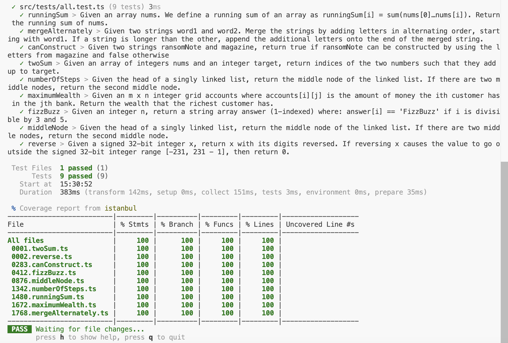

**leetcode beginner challenge** | timeframe: 2-3 days | language: typescript

***tasks***
- [x] use this repository to monitor progress as we go through each challenge
- [x] setup a typescript project and use vitest to test
  * run ```npm run test:coverage```
  
- [x] configure vs code debugger so we can inspect the state of running application   
  * configure file at *.vscode/launch.json*
- [x] run and commit resolutions to all challenges in the beginner section;  this practice require familiarity with the following:
  * ```Map<number, number>```, utilize map to reduce **storage cost**
  * multi-dimentions array, basic double for-loop operation
  * linked-list traverse, utilize two pointers (fast and slow) to find middle, also known as **"tortoise and hare" algorithm**
  * operations on string and array, utilize native **slice** function

